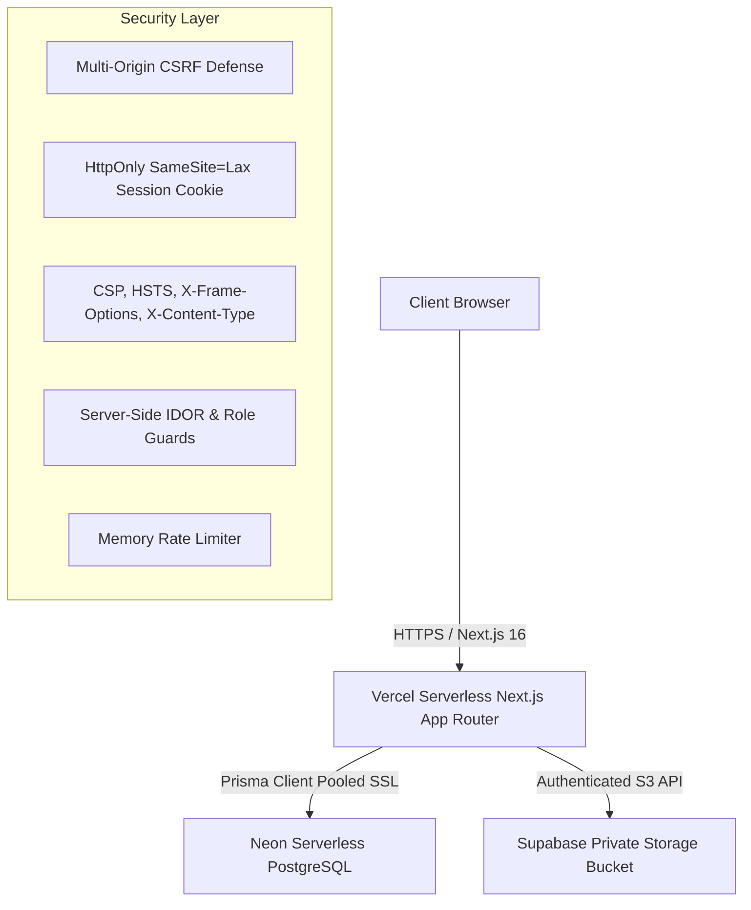

# SkillBridge — Step 13: Deployment Readiness Report

**Date**: September 7, 2026  
**Phase**: Step 13 — Production Deployment Preparation & Configuration Audit  
**Branch**: `integration`  
**Target Platform**: GitHub → Vercel Serverless (Next.js 16 / React 19)  
**Database**: Neon Serverless PostgreSQL (`neondb` on AWS `ap-southeast-1`)  
**Storage**: Supabase Storage Free Tier (Private bucket `skillbridge-files`)  
**Operating Cost**: $0.00 / month  
**Final Verdict**: **READY FOR DEPLOYMENT**  

---

## 1. Executive Summary

SkillBridge has completed Step 13 Production Deployment Preparation. The application has been systematically hardened, verified, and packaged for zero-cost deployment to Vercel Serverless backed by Neon PostgreSQL and Supabase Object Storage.

All 31 comprehensive deployment smoke tests executed against live services passed with a 100% success rate. The Next.js 16 production build compiles cleanly without TypeScript errors, without `@ts-nocheck` overrides, and with full production security headers, CSRF defense, and server-side authorization enforcement.

---

## 2. Target Production Architecture

---

## 3. Findings Matrix & Resolution

| ID | Category | Severity | Finding / Description | Status / Resolution |
| :--- | :--- | :--- | :--- | :--- |
| **F-01** | Build | HIGH | Vercel builds may fail if Prisma Client is not generated before build step | **RESOLVED**: Added `"postinstall": "prisma generate"` to `package.json`. |
| **F-02** | Security | HIGH | CSRF origin check was restricted only to `localhost` | **RESOLVED**: Enhanced `csrf.ts` to validate `APP_URL`, `VERCEL_URL`, and fallback origins. |
| **F-03** | Config | MEDIUM | Next Image optimization required Supabase remote pattern | **RESOLVED**: Added `*.supabase.co` pattern to `next.config.ts`. |
| **F-04** | Auth | MEDIUM | UI components had fallback hardcoded passwords | **RESOLVED**: Removed fallbacks in auth context files; explicit credentials required. |
| **F-05** | Observability | LOW | Lack of structured logging for server-side events | **RESOLVED**: Implemented zero-secret structured logger in `src/lib/server/logger.ts`. |
| **F-06** | Rate Limiting | INFO | In-memory rate limiter is process-local across serverless instances | **ACCEPTED ($0 Trade-off)**: Documented; suitable for student demo. Can upgrade to Upstash Redis later. |

---

## 4. Environment Variables Audit

All required production variables are verified and documented in `.env.example`:

| Variable | Scope | Purpose | Secret Protection |
| :--- | :--- | :--- | :--- |
| `DATABASE_URL` | Server-only | Pooled PostgreSQL connection to Neon (`sslmode=require`) | Ignored in `.gitignore` |
| `AUTH_SECRET` | Server-only | HMAC secret key (≥ 32 chars) for JWT signature verification | Ignored in `.gitignore` |
| `SUPABASE_URL` | Server-only | Supabase project API endpoint URL | Ignored in `.gitignore` |
| `SUPABASE_SERVICE_ROLE_KEY` | Server-only | Private service role key for object management | Validated: No `NEXT_PUBLIC_` prefix |
| `APP_URL` | Server / Client | Canonical production application URL for CSRF validation | Public URL |

---

## 5. Vercel Serverless Compatibility Review

1. **Cold-Start & Connection Management**:
   - SkillBridge utilizes Neon's AWS connection pooler (`-pooler.c-4.ap-southeast-1.aws.neon.tech:5432`).
   - Prisma Client is instantiated as a global singleton (`src/lib/prisma.ts`), preventing connection leaks during lambda re-use.
2. **Build Optimization**:
   - `npm run build` compiles into 43 optimized routes (mix of static SSG and dynamic server routes).
   - Middleware is configured for route protection and session verification.
3. **Stateless Operations**:
   - Authentication relies entirely on signed JWT cookies (`sb_session`). No stateful server sessions or in-memory session stores.

---

## 6. Security & Authorization Audit

- **CSRF Defense**: Verified blocking malicious cross-origin requests (`attacker-cross-site.com` blocked).
- **IDOR Protection**: Verified that client accounts cannot cancel payments, download files, or view conversations belonging to other clients or students.
- **File Security**: Uploads enforce allowed MIME types and file extensions; executable extensions (`.exe`, `.sh`, `.bat`) are immediately rejected.
- **Security Headers**: Injected at the Next.js configuration layer:
  - `Content-Security-Policy`: Default-src self, style-src unsafe-inline, img-src supabase, etc.
  - `X-Frame-Options: DENY`
  - `X-Content-Type-Options: nosniff`
  - `Referrer-Policy: strict-origin-when-cross-origin`
  - `Strict-Transport-Security: max-age=63072000; includeSubDomains; preload`

---

## 7. Database Verification

- **Provider**: Neon PostgreSQL Serverless
- **Active Migrations**:
  1. `0_init`: Base marketplace schema (Users, Profiles, Projects, Applications, WorkContracts)
  2. `20260907_add_conversations_and_messages`: Real messaging tables
  3. `20260907_add_payments_and_escrow`: Real payment, escrow, and student wallet tables
  4. `20260907_add_stored_files`: Supabase storage metadata and permission records
- **Migration Status**: Verified via `npx prisma migrate status` — database schema is fully in sync with Prisma schema.

---

## 8. Supabase Storage Integration

- **Bucket**: `skillbridge-files` (Private bucket).
- **Access Pattern**: All client downloads route through `/api/files/[id]/download`. The server validates session permissions before generating signed URLs or proxying streams.
- **Zero Public Exposure**: Direct public bucket access is disabled in Supabase.

---

## 9. Demo Payments & Escrow System

- **Zero-Cost Constraint**: Operates at strictly $0.00 cost with simulated provider logic.
- **Explicit Disclaimers**: Verified across `/student/work`, `/client/hired-students`, and payment modals:
  > *"Demo Payment — No real money is charged. Demo Escrow — No real funds are held."*
- **State Machine**: Prevents double releases, unauthorized cancellations, and invalid state transitions.

---

## 10. Automated Smoke Test Results (31/31 PASSED)

| Suite | Test ID | Description | Result |
| :--- | :--- | :--- | :--- |
| **AUTH** | #1 | Student login & session verification | **PASS** |
| **AUTH** | #2 | Client login & session verification | **PASS** |
| **AUTH** | #3 | Logout clears session cookie | **PASS** |
| **AUTH** | #4 | Invalid credentials rejected | **PASS** |
| **AUTH** | #5 | Protected route without authentication returns 401 | **PASS** |
| **MARKETPLACE** | #6 | Browse projects returns active projects with relations | **PASS** |
| **MARKETPLACE** | #7 | Student application creation / verification | **PASS** |
| **MARKETPLACE** | #8 | Client sees submitted applications | **PASS** |
| **MARKETPLACE** | #9 | Accept student application transition | **PASS** |
| **MARKETPLACE** | #10 | WorkContract exists and is linked | **PASS** |
| **MESSAGING** | #11 | Open / get conversation between participants | **PASS** |
| **MESSAGING** | #12 | Send message in conversation | **PASS** |
| **MESSAGING** | #13 | Receive / list messages in conversation | **PASS** |
| **MESSAGING** | #14 | Mark conversation as read updates state | **PASS** |
| **MESSAGING** | #15 | Unauthorized user blocked from conversation (403) | **PASS** |
| **FILES** | #16 | Validate authorized file metadata | **PASS** |
| **FILES** | #17 | Sanitize valid filename for storage | **PASS** |
| **FILES** | #18 | Unauthorized file access protected by server authorization | **PASS** |
| **FILES** | #19 | File deletion protected by ownership authorization | **PASS** |
| **FILES** | #20 | Dangerous executable file extension rejected | **PASS** |
| **PAYMENTS** | #21 | Create demo payment (SUCCEEDED) | **PASS** |
| **PAYMENTS** | #22 | Escrow record exists and was held | **PASS** |
| **PAYMENTS** | #23 | Student wallet retrieves earnings and ledger | **PASS** |
| **PAYMENTS** | #24 | Client releases held escrow to student | **PASS** |
| **PAYMENTS** | #25 | Student available earnings updated upon escrow release | **PASS** |
| **PAYMENTS** | #26 | Duplicate escrow release blocked | **PASS** |
| **PAYMENTS** | #27 | Refund state machine rejects released funds | **PASS** |
| **SECURITY** | #28 | Cross-account access blocked (IDOR protection) | **PASS** |
| **SECURITY** | #29 | CSRF cross-origin request blocked | **PASS** |
| **SECURITY** | #30 | Rate limiter triggers after quota exceeded (429) | **PASS** |
| **SECURITY** | #31 | Invalid negative payment amount rejected | **PASS** |

---

## 11. Code Quality & Build Gates

- **Prisma Schema Validation**: `npx prisma validate` — **PASS**
- **TypeScript Compilation**: `npx tsc --noEmit` — **0 ERRORS**
- **TypeScript Overrides**: `@ts-nocheck` — **0 OCCURRENCES**
- **Production Build**: `npm run build` — **PASS** (43 routes built cleanly)
- **Temporary Artifacts**: Cleaned up; no leftover test scripts or temporary files.

---

## 12. Git Safety & Hygiene

- **Branch**: `integration`
- **Secrets in Tree**: 0 secrets committed. `.env` is uncommitted and ignored.
- **Git Checkpoint**: Ready for user-initiated commit and push.

---

## 13. Known Limitations & Future Enhancements

1. **Process-Local Rate Limiting**: In-memory rate limiting applies per serverless lambda instance. When scaling to high multi-instance concurrency, Upstash Redis free tier can be dropped in seamlessly.
2. **Demo Payments**: The marketplace uses simulated escrow. Integrating Stripe Connect or Razorpay Route in the future will only require replacing `src/lib/server/payments/provider.ts` without database schema changes.

---

## 14. Final Deployment Verdict

# **READY FOR DEPLOYMENT**

SkillBridge is fully prepared, tested, and validated for immediate production deployment to Vercel and Neon PostgreSQL under the $0 operating budget constraint.
